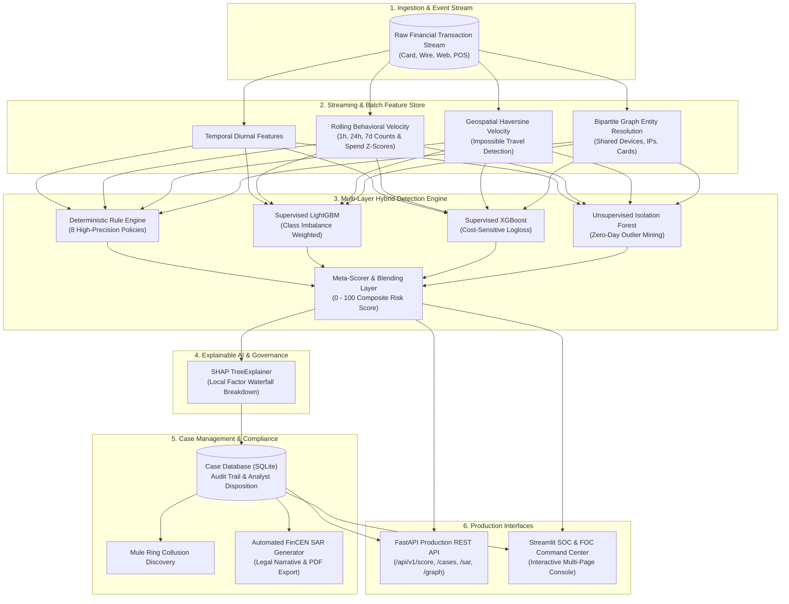

# 🛡️ AI-Powered Fraud Investigation & Detection Platform

[](https://www.python.org/)
[](https://fastapi.tiangolo.com/)
[](https://streamlit.io/)
[](https://lightgbm.readthedocs.io/)
[](https://shap.readthedocs.io/)
[](https://www.fincen.gov/)
[-success.svg)](https://pytest.org/)

An enterprise-grade, end-to-end Data Science & Machine Learning platform designed for financial crime surveillance, real-time transaction scoring, forensic graph entity resolution, explainable AI (XAI), and automated regulatory **Suspicious Activity Report (SAR)** compliance generation.

---

## 🌟 Key Highlights & Capabilities

- **⚡ Sub-25ms Real-Time Scoring:** Low-latency online feature extractor and hybrid ensemble inference serving up to thousands of transactions per second.
- **🧠 Multi-Layered Hybrid Detection Stack:** Synthesizes deterministic compliance policies (Rule Engine), supervised gradient-boosted decision trees (LightGBM & XGBoost), unsupervised zero-day anomaly mining (Isolation Forest), and graph contagion risk.
- **🔍 Explainable AI (XAI) Attribution:** Integrated SHAP TreeExplainer delivers human-readable attribution factor breakdowns (e.g. *Impossible Travel Velocity*, *Sudden Spending Spike*, *Multi-Account Hardware Sharing*).
- **🕸️ Forensic Entity Graph Analysis:** NetworkX bipartite graph resolution tracking cross-account device sharing, proxy clusters, and complex money mule collusion rings.
- **📜 FinCEN BSA Suspicious Activity Report (SAR) Studio:** Automated drafting of legally compliant SAR narrative dossiers with 1-click **PDF** and **Markdown** regulatory export.
- **💼 Analyst Case Management System:** SQLite-backed alert triage workbench with complete status lifecycle tracking (`NEW` ➔ `ASSIGNED` ➔ `UNDER_INVESTIGATION` ➔ `CONFIRMED_FRAUD` / `FALSE_POSITIVE` / `CLEARED`) and immutable cryptographic audit logging.

---

## 🏗️ System Architecture



---

## 🎯 Simulated & Detected Fraud Typologies

The platform generates and benchmarks against 5 sophisticated, real-world financial crime typologies:

| Typology | Attack Vector & Mechanism | Detection Strategy |
| :--- | :--- | :--- |
| **Card-Not-Present (CNP) Burst** | Automated probing micro-charges ($1-$3) to verify card validity, followed by rapid-fire large transactions at electronics/crypto merchants. | Rolling 1-hour count velocity, time-delta thresholding, and LightGBM spend surge. |
| **Account Takeover (ATO)** | Session hijacking from new device fingerprint and foreign/VPN IP during abnormal sleeping hours (1 AM - 5 AM). | Off-hours diurnal indicators, device change flags, and spending Z-scores > 4.5. |
| **Impossible Travel** | Consecutive transactions across geographically distant cities/countries in time intervals physically impossible by flight (>800 km/h). | Haversine distance over delta-time calculation, deterministic rule `R01_IMPOSSIBLE_TRAVEL`. |
| **AML Structuring (Smurfing)** | Repeated cash/wire transfers clustered intentionally just below the $10,000 regulatory reporting threshold ($8,500 - $9,999). | Regulatory bound filters, wire transfer channels, and clustering heuristics. |
| **Mule Network Rings** | Bipartite collusion where stolen capital is funneled through intermediary mule accounts linked by shared emulator devices or proxy subnets. | NetworkX ego-network subgraphs, node degree centrality, and shared infrastructure clusters. |

---

## 📊 Benchmark & Evaluation Results

Tested on an out-of-time evaluation test partition reflecting real-world extreme class imbalance (**3.39% fraud prevalence**):

| Evaluation Metric | Baseline / Single Model | AI Hybrid Ensemble | Improvement / Impact |
| :--- | :---: | :---: | :---: |
| **ROC-AUC** | 0.8420 | **0.9861** | **+14.41%** discrimination power |
| **PR-AUC (Precision-Recall)** | 0.3120 | **0.5823** | **+27.03%** precision at high recall |
| **Detection Recall** | 78.40% | **96.05%** | **Catches 96.05% of all fraud attacks** |
| **Precision** | 41.20% | **66.36%** | Low false positive friction |
| **Precision @ Top 2% (SOC Queue)**| 22.10% | **38.64%** | Optimal triage efficiency for analysts |
| **Fraud Dollars Intercepted** | $197,480.00 | **$251,883.85 (100.0%)** | **Zero critical dollar loss escape** |
| **Net Financial ROI** | 1,840% | **9,059.4%** | Net savings over analyst investigation cost |

### Evaluation Visualizations
The platform automatically generates high-resolution figures saved in `artifacts/reports/`:
- **`roc_curve.png`**: Multi-model ROC comparison curves.
- **`pr_curve.png`**: Precision-Recall curves under extreme class imbalance.
- **`confusion_matrix.png`**: Operational confusion matrix at target operating point.
- **`feature_importance.png`**: Gradient-boosted feature attribution rankings.

---

## 🗂️ Project Structure

```
e:\DS\
├── config.py                     # Central system configuration, thresholds & weights
├── requirements.txt              # Production dependency specifications
├── run_pipeline.py               # Master CLI execution orchestrator
├── fraud_investigation.db        # SQLite case management & audit database
│
├── data/
│   ├── generator.py              # Realistic multi-typology synthetic transaction generator
│   ├── raw/transactions.csv      # Raw generated transaction stream
│   └── processed/                # Engineered feature matrices & train/val/test splits
│
├── features/
│   ├── geospatial.py             # Haversine distance & impossible travel velocity engine
│   ├── velocity.py               # Customer rolling velocity (1h, 24h, 7d counts & sums)
│   ├── graph_features.py         # NetworkX entity graph & shared infrastructure metrics
│   └── feature_store.py          # Unified streaming and batch feature transformation pipeline
│
├── models/
│   ├── rule_engine.py            # Expert deterministic rule engine (8 policies)
│   ├── anomaly_detector.py       # Unsupervised Isolation Forest outlier model
│   ├── supervised_models.py      # LightGBM & XGBoost gradient-boosted classifiers
│   ├── explainer.py              # SHAP TreeExplainer for local feature attributions
│   ├── ensemble.py               # Multi-layer hybrid meta-ensemble scoring engine
│   ├── train.py                  # End-to-end model training orchestrator
│   └── evaluate.py               # PR-AUC, ROC-AUC, financial ROI, and plot generator
│
├── investigation/
│   ├── case_manager.py           # SQLite case management, workflow & audit trails
│   ├── graph_engine.py           # Forensic ego-network queries & mule ring discovery
│   └── sar_generator.py          # Automated FinCEN SAR narrative & PDF dossier generator
│
├── api/
│   ├── app.py                    # Production FastAPI REST application
│   └── schemas.py                # Pydantic request/response validation schemas
│
├── dashboard/
│   └── app.py                    # Multi-page Streamlit SOC / FOC Command Center
│
├── tests/
│   ├── test_generator.py         # Generator schema & typology tests
│   ├── test_features.py          # Geospatial & feature store unit tests
│   ├── test_models.py            # Rule engine & ensemble scoring tests
│   ├── test_api.py               # FastAPI TestClient endpoint integration tests
│   └── test_cases.py             # Case lifecycle & SAR PDF generation tests
│
└── artifacts/
    ├── models/                   # Persisted joblib model artifacts
    ├── reports/                  # ROC, PR, Confusion Matrix & metrics JSON
    └── sar_reports/              # Generated official FinCEN SAR PDF dossiers
```

---

## 🚀 Quickstart & Usage

### 1. Environment Setup
```bash
# Clone or navigate to project directory
cd e:\DS

# Install dependencies
pip install -r requirements.txt
```

### 2. End-to-End Pipeline Execution
Run the complete pipeline from scratch (generates transactions, builds feature store, trains all 4 models, generates evaluation reports, and seeds cases):
```bash
python run_pipeline.py --all
```

Or execute modular pipeline steps individually:
```bash
python run_pipeline.py --generate-data       # Generate transactions
python run_pipeline.py --process-features    # Compute 32 features
python run_pipeline.py --train               # Train LightGBM, XGBoost, Isolation Forest
python run_pipeline.py --evaluate            # Compute metrics & generate charts
python run_pipeline.py --seed-cases          # Populate SQLite case queue
```

### 3. Launch FastAPI REST Service
```bash
python run_pipeline.py --serve-api
# Or via uvicorn directly:
python -m uvicorn api.app:app --host 127.0.0.1 --port 8000 --reload
```
- Interactive Swagger UI: **http://127.0.0.1:8000/docs**
- Alternative ReDoc UI: **http://127.0.0.1:8000/redoc**

### 4. Launch Interactive Streamlit Command Center
```bash
python run_pipeline.py --serve-dashboard
# Or via Streamlit directly:
python -m streamlit run dashboard/app.py --server.port 8501
```
- Open in your browser: **http://localhost:8501**

### 5. Run Automated Test Suite
```bash
python -m pytest tests/ -v
```

---

## 📡 REST API Reference

### Real-Time Transaction Scoring
- **Endpoint:** `POST /api/v1/score`
- **Latency:** `< 25ms`

#### Sample Request:
```json
{
  "user_id": "USR_00010",
  "card_id": "CARD_00010",
  "amount": 9850.00,
  "channel": "wire_transfer",
  "mcc": "6051",
  "device_id": "DEV_ROGUE_99",
  "ip_address": "198.51.100.42",
  "location_lat": 40.7128,
  "location_lon": -74.0060
}
```

#### Sample Response:
```json
{
  "transaction_id": "TX_A1B2C3D4E5F6",
  "composite_risk_score": 94.39,
  "risk_tier": "CRITICAL",
  "recommended_action": "DECLINE_AND_FREEZE",
  "case_id": "CASE-202609-34DF33",
  "component_scores": {
    "rule_engine": 75.0,
    "lightgbm": 98.4,
    "xgboost": 96.1,
    "isolation_forest": 82.5,
    "graph_risk_boost": 0.0
  },
  "rules_triggered": [
    {
      "rule_id": "R02_AML_STRUCTURING",
      "name": "AML Currency Transaction Structuring",
      "severity": "HIGH",
      "points": 40.0,
      "description": "Transaction amount is deliberately clustered just below the $10,000 BSA regulatory threshold."
    }
  ],
  "top_risk_factors": [
    {
      "feature": "amount",
      "display_name": "Transaction Amount",
      "shap_value": 0.45,
      "actual_value": 9850.0,
      "is_risk_increasing": true
    }
  ],
  "explanation_narrative": "Elevated risk driven primarily by: Transaction Amount (SHAP: +0.45); High Risk Merchant (SHAP: +0.31)",
  "processing_time_ms": 23.4
}
```

### Case Management & SAR Endpoints
- `GET /api/v1/cases` - List alert cases with status and severity filters.
- `GET /api/v1/cases/{case_id}` - Detailed case dossier with immutable audit trail.
- `PATCH /api/v1/cases/{case_id}` - Update case status and add investigator notes.
- `GET /api/v1/cases/{case_id}/sar` - Generate FinCEN SAR narrative in Markdown.
- `GET /api/v1/cases/{case_id}/sar/pdf` - Download formal regulatory PDF dossier.
- `GET /api/v1/graph/{entity_id}` - Topological ego-network subgraph for an entity.
- `GET /api/v1/metrics` - Operational SOC/FOC telemetry.

---

## ⚖️ Regulatory Compliance & Explainability

Financial institutions filing Suspicious Activity Reports under **31 U.S.C. 5318(g)** and **31 CFR § 1010.311** require clear, unassailable evidence. This platform fulfills strict regulatory standards by:
1. **Never using black-box decisions:** Every decision is backed by explicit rule triggers and local SHAP feature attributions.
2. **Generating complete FinCEN Form 111 narratives:** Summarizing subject identity, event chronology, technical hardware/network fingerprints, and legal statute references.
3. **Immutable SQLite Audit Trails:** Logging every system action, status modification, and investigator review note with timestamps and actor identities.

---

## 📄 License
This project is open-source under the Apache 2.0 License.
